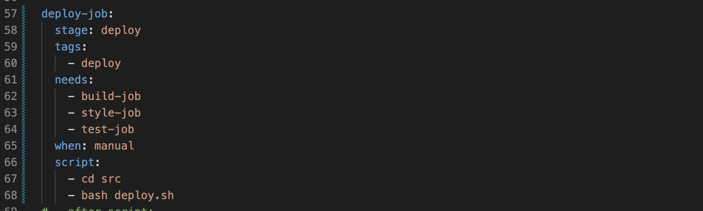

# Basic CI/CD

## Part 1. Настройка **gitlab-runner**

#### Подними виртуальную машину *Ubuntu Server 22.04 LTS*.
*Будь готов, что в конце проекта нужно будет сохранить дамп образа виртуальной машины.*

1. Поднял Ubuntu Server 22.04 LTS

#### Скачай и установи на виртуальную машину **gitlab-runner**.

2. Скачал и установил командами `curl -L "https://packages.gitlab.com/install/repositories/runner/gitlab-runner/script.deb.sh" | sudo bash` и `sudo apt-get install gitlab-runner`

#### Запусти **gitlab-runner** и зарегистрируй его для использования в текущем проекте (*DO6_CICD*).
- Для регистрации понадобятся URL и токен, которые можно получить на страничке задания на платформе.

3. Запустил и зарегестрировал командами `sudo gitlab-runner start` и `sudo gitlab-runner register`

## Part 2. Сборка

#### Напиши этап для **CI** по сборке приложений из проекта *C2_SimpleBashUtils*.
#### В файле _gitlab-ci.yml_ добавь этап запуска сборки через мейк файл из проекта _C2_.
#### Файлы, полученные после сборки (артефакты), сохрани в произвольную директорию со сроком хранения 30 дней.

## Part 3. Тест кодстайла

#### Напиши этап для **CI**, который запускает скрипт кодстайла (*clang-format*).

#### Если кодстайл не прошел, то «зафейли» пайплайн.

#### В пайплайне отобрази вывод утилиты *clang-format*.

## Part 4. Интеграционные тесты

#### Напиши этап для **CI**, который запускает твои интеграционные тесты из того же проекта.

1. написал

#### Запусти этот этап автоматически только при условии, если сборка и тест кодстайла прошли успешно.

2. Добавил `when: on_success`

#### Если тесты не прошли, то «зафейли» пайплайн.

#### В пайплайне отобрази вывод, что интеграционные тесты успешно прошли / провалились.

## Part 5. Этап деплоя

`-` Для завершения этого задания ты должен перенести исполняемые файлы на другую виртуальную машину, которая будет играть роль продакшна. Удачи.

**== Задание ==**

#### Подними вторую виртуальную машину *Ubuntu Server 22.04 LTS*.

1. Поднял и настроил

2. Далее создал на пользователя gitlab-runner на виртуальной машине everettl@everettl. Создал ключ доступа, скопировал его и настроил доступ по ssh.

Для этого использовал команды:
sudo su gitlab-runner - переключился на пользователя
ssh-keygen -t rsa -b 2048 - сгенерировал ключ
ssh-copy-id cd@192.168.100.15 - скопировал на вторую виртуальную машину
ssh cd@192.168.100.15 - подключился удаленно ко второй машине

Далее на виртуальной машине cd@192.168.100.15 так же сгенерировал ключ и настроил доступ.
ssh-keygen -t rsa -b 2048
ssh-copy-id cd@192.168.100.14
sudo chown -R $(whoami) /usr/local/bin

> sudo chown -R $(whoami) /usr/local/bin изменяет владельца и группу для всех файлов и каталогов в директории /usr/local/bin на текущего пользователя, который исполняет эту команду. (chown - change owner)

#### Напиши этап для **CD**, который «разворачивает» проект на другой виртуальной машине.
#### Запусти этот этап вручную при условии, что все предыдущие этапы прошли успешно.

2. Написал этап деплоя. Добавил условие запуска вручную `when: manual`

#### Напиши bash-скрипт, который при помощи **ssh** и **scp** копирует файлы, полученные после сборки (артефакты), в директорию */usr/local/bin* второй виртуальной машины.

4. Написал скрипт

#### В файле _gitlab-ci.yml_ добавь этап запуска написанного скрипта.

5. Добавил

#### В случае ошибки «зафейли» пайплайн.

В результате ты должен получить готовые к работе приложения из проекта *C2_SimpleBashUtils* (s21_cat и s21_grep) на второй виртуальной машине.

#### Сохрани дампы образов виртуальных машин.
**P.S. Ни в коем случае не сохраняй дампы в гит!**
- Не забудь запустить пайплайн с последним коммитом в репозитории.

## Part 6. Дополнительно. Уведомления

**== Задание ==**

##### Настрой уведомления о успешном/неуспешном выполнении пайплайна через бота с именем «[твой nickname] DO6 CI/CD» в *Telegram*.

1. Создал своего бота через BotFather в ТГ и использовал предоставленный токен. Кроме того, узнал свой ID через getmyid_bot в ТГ. Далее написал скрипт и настроил уведомления.

