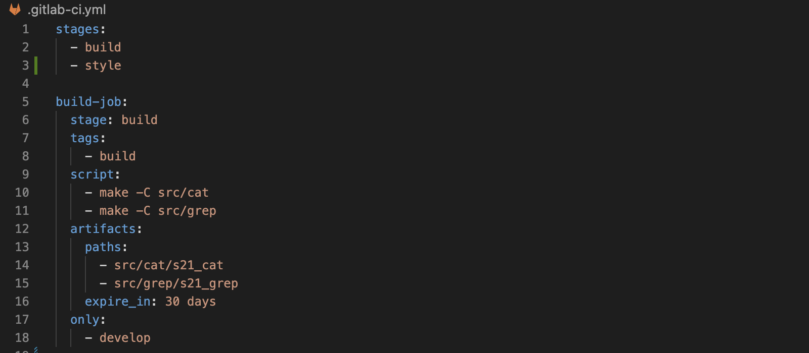

# Basic CI/CD

### Part 1. Настройка **gitlab-runner**

##### Подними виртуальную машину *Ubuntu Server 22.04 LTS*.
*Будь готов, что в конце проекта нужно будет сохранить дамп образа виртуальной машины.*

1. Поднял Ubuntu Server 22.04 LTS

##### Скачай и установи на виртуальную машину **gitlab-runner**.

2. Скачал и установил командами `curl -L "https://packages.gitlab.com/install/repositories/runner/gitlab-runner/script.deb.sh" | sudo bash` и `sudo apt-get install gitlab-runner`

##### Запусти **gitlab-runner** и зарегистрируй его для использования в текущем проекте (*DO6_CICD*).
- Для регистрации понадобятся URL и токен, которые можно получить на страничке задания на платформе.

3. Запустил и зарегестрировал командами `sudo gitlab-runner start` и `sudo gitlab-runner register`

### Part 2. Сборка

#### Напиши этап для **CI** по сборке приложений из проекта *C2_SimpleBashUtils*.
##### В файле _gitlab-ci.yml_ добавь этап запуска сборки через мейк файл из проекта _C2_.
##### Файлы, полученные после сборки (артефакты), сохрани в произвольную директорию со сроком хранения 30 дней.

### Part 3. Тест кодстайла

#### Напиши этап для **CI**, который запускает скрипт кодстайла (*clang-format*).

##### Если кодстайл не прошел, то «зафейли» пайплайн.

##### В пайплайне отобрази вывод утилиты *clang-format*.

### Part 4. Интеграционные тесты